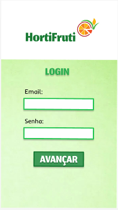
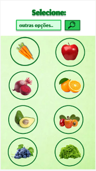
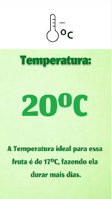
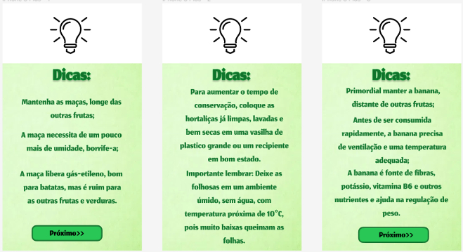

## Seminário de Orientação do Projeto Integrador
CURSO: TECNOLOGIA EM SISTEMAS PARA INTERNET

TEMA: SISTEMA DE GERENCIAMENTO PARA FRUTAS E VERDURAS

GRUPO: 
 FERNANDA BEATRIZ TAVARES GOMES

 POLIANA DE ARAUJO PEREIRA

 JONATHAN LEONCIO DE SOUZA LIRA
 
 ## Proposta do Projeto
 #### Esse projeto tem o objetivo de realizar analise de dados das frutas e hortaliças, para reduzir o desgaste desses alimentos. Através de um dispositivo para controle dos dados referentes a temperatura, umidade e fluxo de ventilação do ar, como também dados sobre ambiente adequado, transporte e dicas para melhor conservação, essas informações serão apresentadas para os usuários através da exibição no aplicativo.
 
 
## Interfaces do Aplicativo (Protótipo)
#### Esse trabalho consiste em apresentar capturas do prototipo das interfaces gráficas e suas respectivas descrições para assim informar sobre as funcionalidades e fluxos para o aplicativo que será desenvolvido e utilizado durante o desenvolvimento do Projeto Integrador.

### Interface 1 : Tela Inicial (Fernanda)
#### A Interface Inicial do aplicativo, que será a primeira a ser exibida para os usuários, trazendo dados sobre o aplicativo e formas para se conectar e usar o aplicativo. Possui uma logomarca (à definir), uma pequena descrição para informar o objetivo do aplicativo ao usuário, um botão para realizar o cadastro dos usuários para poderem assim utilizar o software e um botão para realizar o login quando o usuário ja tiver um cadastro feito.

### Interface 2: Login e Cadastro (Fernanda)
#### As Próximas Interfaces são: Cadastro, em que os usuários poderão registrar seus dados, deixando-os armazenados para os próximos acessos os dados, que deverão ser preenchidos são Nome da Empresa ou nome do Responsável pela empresa, email para login e a senha de acesso do sistema, também possui a logomarca para identificação e o botão para confirmação do formulário. Já para a tela de realizar login, possui o preenchimento dos dados de email e senha, que haverá a verificação para o login, e o botão para avançar.
 

### Interface 3 : Menu das frutas/verduras (Poliana)
#### Para o usuário selecionar as opções das frutas disponíveis é clicar no botão da imagem da fruta necessária ou hortaliça. Caso não tenha o botão da fruta ou hortaliça no menu, será pesquisado atras do botão "outras opções" no espaço ou o usuário colocará digitado a fruta ou hortaliça e clica no botão da lupa de pesquisar. Após clicar em fruta disponível no menu ou escrever a opção vai ser enviada para outra tela com a dica da fruta ou hortaliça.

### Interface 4 : Menu de dados (Fernanda)
#### Após escolher a fruta ou verdura que será analisada pelo dispositivo, o usuário será direcionado para a interface contendo um Menu com todos os dados e fluxos que poderão ser apresentados, no caso, botões com seus respectivos caminhos, para analise de dados da temperatura, umidade, ventilação e também fluxos para ambiente adequado, condições no transporte e dicas para melhor conservação desses alimentos.

### Interface 5 : Temperatura (Jonathan)
#### Logo após passar pela Tela do MENU de DADOS, e anteriormente escolhido o tipo de de fruta ou verdura para análise, e posteriormente definido a CATEGORIA DO INDICADOR DE MEDIDA DE CONDIÇÕES dos produtos, você chegará a esta tela acerca da TEMPERATURA, embora esteja explícito a informação dos dados exclusivamente da fruta MAÇÃ, você pode optar por escolher qualquer outro tipo de dado sobre uma outra fruta, ou hortaliça de seu interesse/necessidade.

### Interface 6 : Umidade (Jonathan)
#### Nesta tela destacar o informe do percentual adequado de Umidade para determinadas frutas e hortaliças em geral, pois boa parte precisam de uma umidade correspondente a umidade relativa ao seu ambiente natural, com 50 %, pois Umidade muito abaixo causa o ressecamento desses produtos e leva ao inevitável perda de nutrientes

### Interface 7 : Ambiente (Jonathan)
#### Após passar pela Interface correspondente ao MENU de DADOS, nesta tela de direcionamento referente ao AMBIENTE é importante que O bom uso do frio por meio de uma Cadeia de Refrigeração bem ativado & Organizada uma grande importância na manutenção da qualidade das frutas e /ou hortaliças. Ao respirar como quaisquer plantas das plantas as frutas/horizonte continuando e transpirando como vivo. Aqui o Usuário/cliente terá a oportunidade de conferir tipos de locais mais adequados para o controle total dos produtos de seu interesse

### Interface 8 : Transporte (Poliana)
#### Nesta interface a imagem do transporte é apenas ilustrativa não serve como botão. No eclipse com fundo verde que demonstrará através de uma nova temperatura é um botão que irá mostrar a página que medirá a temperatura máxima, média e outro eclipse com imagem de mapa é um botão que analisaremos se será necessário uma interface ou será um link para páginas.

### Interface 9 : Dicas (Poliana)
#### Esta interface é responsavel por apresentar informações (dicas) para a melhor conservação de cada fruta ou hortaliça. Após a escolha do tipo de fruta/verdura, no menu de dados acessando através do botão de dicas, terá interfaces parecidas com as apresentadas a seguir, cadastraremos também dicas que englobam todas os tipos para quando a fruta especifica não dispor de informações individuais. Para auxiliar os usuários na conservação e redução do desperdicio.

### Referências
#### Interfaces desenvolvidas no site Figma, acesso em: https://www.figma.com/file/8SHqs54sIrCo1XMQjrcTdA/Untitled?node-id=0%3A1
#### Visualização para Dispositivos móveis (celulares), mas também será responsivo para diversos dispositivos. Exemplo de visualização no dispositivo, acesso em: https://www.figma.com/proto/8SHqs54sIrCo1XMQjrcTdA/Untitled?node-id=2%3A2&scaling=contain&page-id=0%3A1

